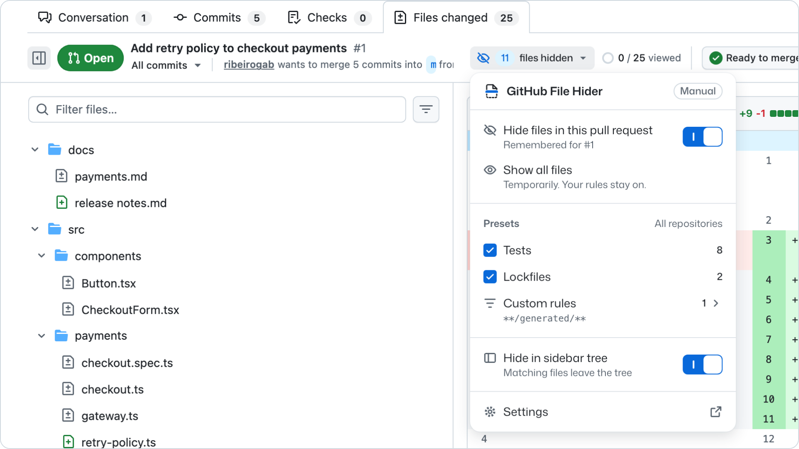

  <picture>
    <source media="(prefers-color-scheme: dark)" srcset="store/readme-logo-dark.png">
    
  </picture>
  <h1>GitHub File Hider</h1>
  

    <strong>Review the code that matters first.</strong> 
    A Chrome extension that hides tests, lockfiles, and other noise from the Files changed tab of GitHub pull requests.
  

  

    
    
    
  

<picture>
  <source media="(prefers-color-scheme: dark)" srcset="store/readme-dark.png">
  
</picture>

## Features

- **Presets** for tests and lockfiles, and **custom rules** such as `docs/**` or `**/generated/**`.
- **Always show** rules keep important files visible.
- **One pull request or all of them.** Hide files with one click, remembered per pull request, or turn on automatic mode.
- **Show all files** at any time. A direct link to a hidden file still opens it.
- **Sidebar tree** follows your rules, or stays complete.
- **Feels built in.** Matches GitHub's components in light and dark themes.

## Usage

1. Sign in to github.com and open the **Files changed** tab of a pull request.
2. Open the **Hide files** menu in the toolbar and turn on **Tests** or **Lockfiles**.
3. Select **Hide files**. Matching files leave the diff and the sidebar tree.

To add your own rules, select the extension icon in the Chrome toolbar to open the Settings page.

## Install

[Install from the Chrome Web Store](https://chromewebstore.google.com/detail/github-file-hider/nocgonekcilofckcilmhpjldgkclkcbf).

Install from a ZIP

1. Download `github-file-hider-YYYY.MM.DD.N.zip` from [GitHub Releases](https://github.com/ribeirogab/github-file-hider/releases).
2. Extract the ZIP into a folder that you keep, for example `~/Extensions/github-file-hider`.
3. Open `chrome://extensions`, turn on **Developer mode**, select **Load unpacked**, and choose that folder.

To update, extract the new ZIP into the same folder, select **Reload** on the extension card in `chrome://extensions`, and reload open GitHub tabs. Keep the same folder, so Chrome keeps your settings.

## Privacy

No account, no server, no tracking. Settings stay in your browser. The extension runs only on github.com and changes only what you see. It never changes files, comments, reviews, or viewed state.

## Development

See [docs/development.md](docs/development.md) to build, test, and release the extension, and the [product overview](docs/product.md) for how it works.

## License

[MIT](LICENSE). Mona Sans is licensed under the [SIL Open Font License 1.1](src/fonts/OFL.txt).

GitHub File Hider is not affiliated with GitHub.
